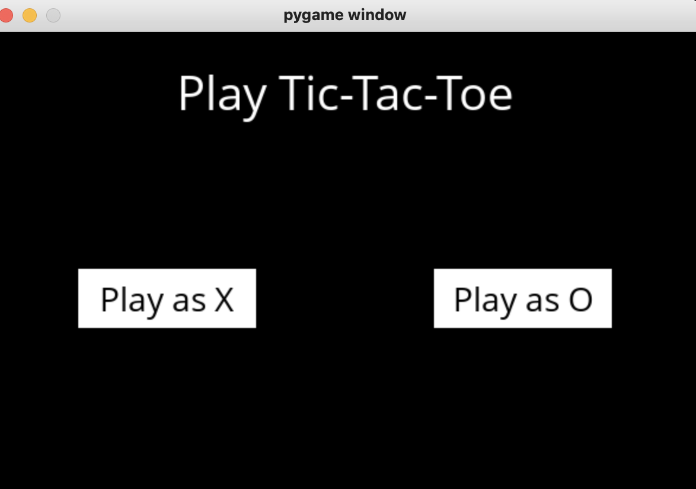
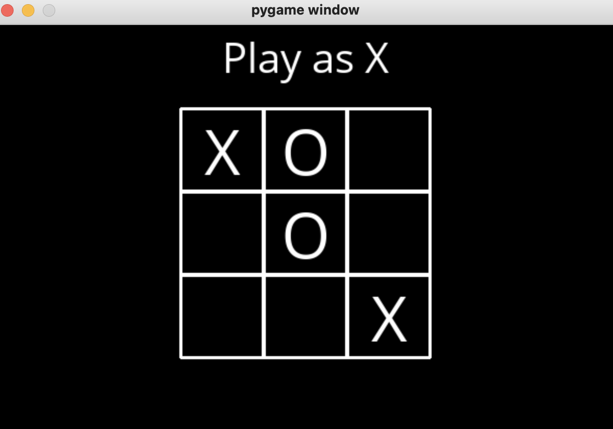
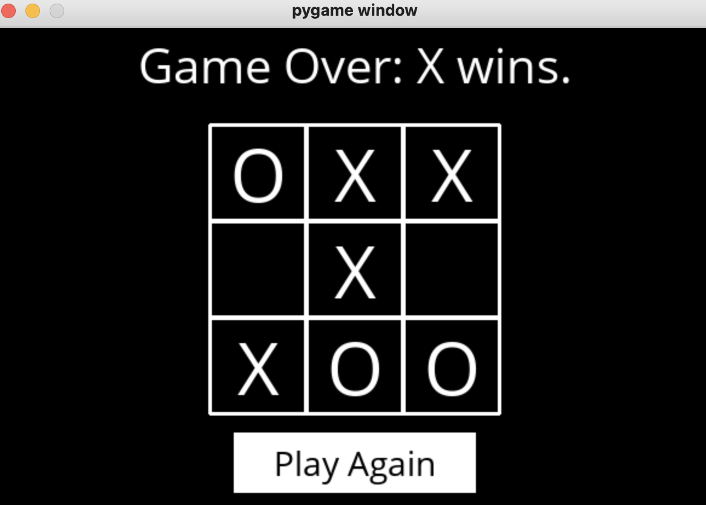

# TicTacToe
Undefeatable tic-tac-toe bot that uses a minimax algorithm and reinforcement learning to find the best moves possible. The project is also based on Harvard online course CS50: Intro to Artificial Intelligence. 

The AI calculates the safe moves in the board by associating a number for the each possible states in the board. The AI will either try to maximize or minimize the points based on whether it is playing as X or O.

The game can only result in draw or lose. Go ahead and give a try.

### Requirements:
1. python
2. pyGame 
  

### To play the game, 
1. Download all the files into your local directory
2. cd to the same directory from the command line
3. type "python runner.py" and press Enter
4. Enjoy

Game Instructions: Play as X or O. 

----

Some screenshots from the game

